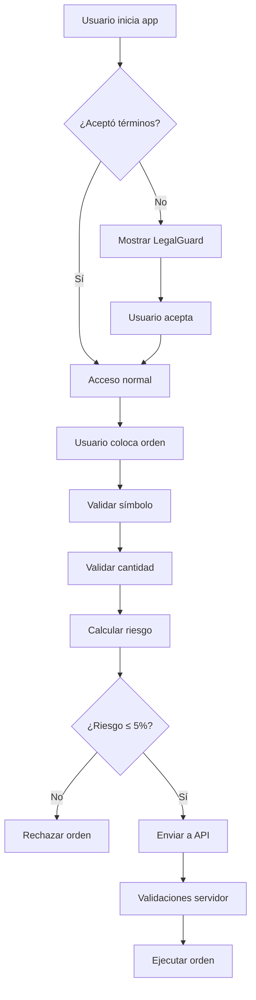

# Paquete de Cumplimiento Legal + Límites de Riesgo

## 📋 Resumen

Este paquete implementa un sistema completo de cumplimiento legal y gestión de riesgo para QuantumTrade AI, incluyendo:

- **Banner/Modal Legal** con aceptación persistente
- **Guard de riesgo** del 5% de equity (cliente)
- **API segura** con validaciones de símbolos y tamaños
- **Modo Paper por defecto** en producción

## 🏗️ Arquitectura

### Frontend (Cliente)
- `src/constants/compliance.ts` - Constantes de compliance
- `src/components/LegalGuard.tsx` - Modal de aceptación legal
- `src/components/LegalView.tsx` - Página de términos legales
- `src/lib/risk.ts` - Validaciones de riesgo del cliente

### Backend (API)
- `api/order.ts` - Endpoint con validaciones de seguridad

## 🔧 Configuración

### Variables de Entorno

```bash
# Compliance & Risk Management
TRADING_MODE=paper                    # paper | live
ALLOWED_SYMBOLS=BTCUSDT,ETHUSDT      # Símbolos permitidos
MAX_RISK_PCT=0.05                    # 5% máximo por operación
```

### Configuración en Vercel

1. **Producción**: `TRADING_MODE=paper` (por defecto)
2. **Preview**: `TRADING_MODE=paper` (recomendado)
3. **Desarrollo**: `TRADING_MODE=paper` (por seguridad)

## 🛡️ Características de Seguridad

### 1. Modal Legal
- **Aceptación obligatoria** antes de usar la plataforma
- **Persistencia** en localStorage con versión
- **Navegación** a página de términos legales
- **Bloqueo** de scroll hasta aceptar

### 2. Validación de Riesgo (Cliente)
- **Límite del 5%** del equity por operación
- **Cálculo automático** de cantidad máxima
- **Feedback visual** del porcentaje de riesgo
- **Prevención** de órdenes que excedan el límite

### 3. API Guards (Servidor)
- **Whitelist de símbolos** (BTCUSDT, ETHUSDT)
- **Validación de tamaños** por equity
- **Modo Paper por defecto** en producción
- **Logs de seguridad** sin información sensible

## 📊 Flujo de Validación



## 🎯 Uso

### LegalGuard
```tsx
import LegalGuard from './components/LegalGuard';

// En App.tsx
<LegalGuard onNavigateToLegal={() => setCurrentView('legal')} />
```

### Validación de Riesgo
```tsx
import { ensureQtyWithinRisk, getRiskStatus } from './lib/risk';

const validation = ensureQtyWithinRisk(qty, equity, price);
if (!validation.success) {
  // Mostrar error al usuario
  console.error(validation.error);
}
```

### API de Órdenes
```typescript
// POST /api/order
{
  "symbol": "BTCUSDT",
  "side": "BUY",
  "qty": 0.001
}
```

## 🔒 Seguridad

### Cliente
- ✅ Validación de símbolos permitidos
- ✅ Límite de riesgo del 5%
- ✅ Feedback visual del riesgo
- ✅ Prevención de órdenes peligrosas

### Servidor
- ✅ Whitelist de símbolos
- ✅ Validación de equity
- ✅ Modo Paper por defecto
- ✅ Logs sin información sensible
- ✅ Manejo de errores robusto

## 📝 Logs y Monitoreo

### Cliente
```typescript
console.log('[RISK]', {
  qty,
  maxQty,
  riskPercentage,
  isWithinRisk
});
```

### Servidor
```typescript
console.log('[ORDER API]', {
  symbol,
  side,
  qty,
  riskValidation: 'passed' | 'failed',
  mode: 'paper' | 'live'
});
```

## 🚀 Despliegue

### Variables Requeridas en Vercel
```bash
TRADING_MODE=paper
ALLOWED_SYMBOLS=BTCUSDT,ETHUSDT
MAX_RISK_PCT=0.05
```

### Verificación Post-Deploy
1. ✅ Modal legal aparece en primera visita
2. ✅ Aceptación persiste en localStorage
3. ✅ Validación de riesgo funciona
4. ✅ API rechaza símbolos no permitidos
5. ✅ API valida límites de riesgo

## 🔄 Mantenimiento

### Actualizar Términos Legales
1. Modificar `LEGAL_DISCLAIMER` en `compliance.ts`
2. Incrementar `LEGAL_VERSION`
3. Los usuarios verán el modal nuevamente

### Agregar Símbolos
1. Actualizar `ALLOWED_SYMBOLS` en variables de entorno
2. Actualizar `COMPLIANCE_CONFIG.ALLOWED_SYMBOLS`
3. Redesplegar aplicación

### Cambiar Límite de Riesgo
1. Actualizar `MAX_RISK_PCT` en variables de entorno
2. Actualizar `COMPLIANCE_CONFIG.MAX_RISK_PERCENTAGE`
3. Redesplegar aplicación

## 📞 Soporte

Para problemas o preguntas sobre el sistema de compliance:
- Revisar logs del cliente y servidor
- Verificar variables de entorno
- Comprobar localStorage para aceptación legal
- Validar configuración de Vercel
